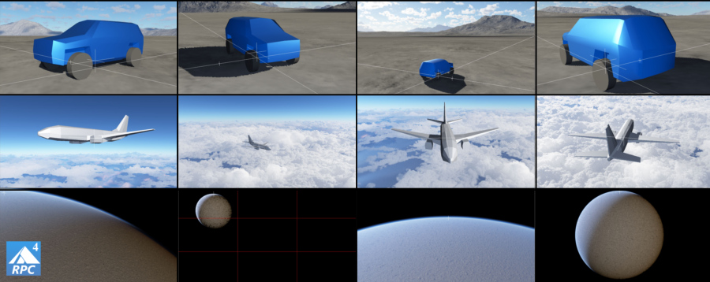
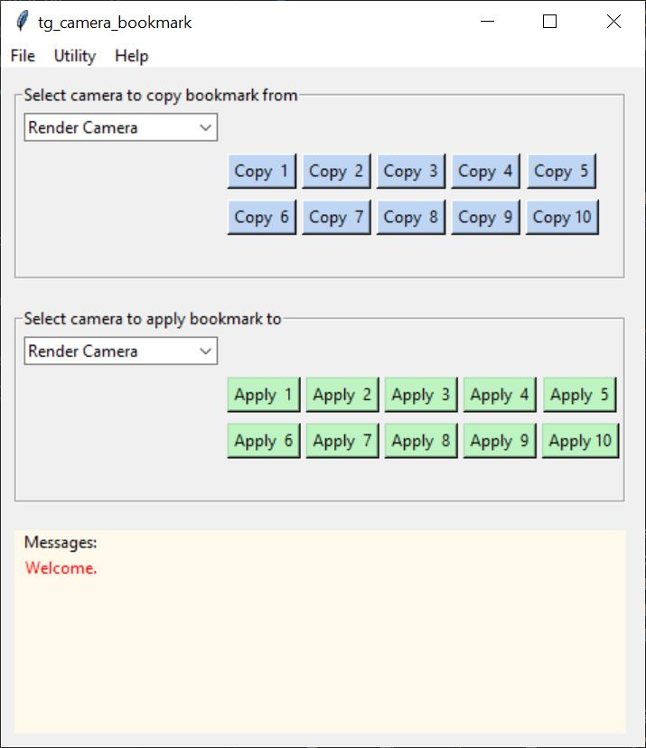

# tg-camera-bookmarks

A fully functional Python script implementing Terragen 4 Professional’s remote procedure call (RPC) feature to allow the user to “bookmark” a camera’s point of view and later recall it, even from disk. 

Any camera’s “position”, “rotation” and “focal length in mm” parameters may be stored to one of ten preset caches where they can then be applied to any other camera in the project.  Caches can be saved or loaded from disk, allowing the user to create a series of presets.
### Usage:

Select a camera from the “Copy bookmark” dropdown list and click one of the buttons labeled “Copy” to store the selected camera’s position, rotation and focal length parameters to that memory cache.
* The camera’s current values are copied to the bookmark cache. If the camera has been animated, the values for the current frame are copied, whether those values are keyframed or interpolated.
* Terragen uses the Perspective camera when navigating around the 3D Preview.  If you want to copy the values from the Perspective camera, first click on the “Copy this view to the current render camera” button near the bottom left of the 3D Preview pane.

Select a camera from the “Apply bookmark” dropdown list and click one of the buttons labeled “Apply” to paste the cached position, rotation and focal length values to the selected camera.
* The bookmark values are applied to the selected camera for the current frame, temporarily overwriting the previous values.  
* Scrubbing the timeline or changing the frame reverts the values back to their original values.

**File menu > Open bookmarks:** Select this option and choose a bookmark file to populate the ten preset caches in memory.

**File menu > Save bookmarks:** Select this option to save the ten preset cache values in memory to disk.

**Utility > Display bookmarks:** Displays the current values currently assigned to the ten preset caches.

**Utility > Reset bookmarks:** Resets the ten preset cache values to the default Terragen camera values.  Position is set to 0,10,-30 on the XYZ axis.  Rotation is set to -7 degrees for Pitch, and zero degrees for Heading and Bank.  Camera focal length is set to 31.17 mm.

**Utility > Reset  bookmarks to zero**: Resets all ten preset cache values in memory.  Position is set to the origin of the project, i.e. 0,0,0 on the XYZ axis.  Rotation is set to zero degrees for Pitch, Heading, and Bank.   Camera focal length is set to Terragen’s default camera of 31.17 mm.

**Help > For file menu:** Displays help information for the dropdown menu options under the File menu.
 
**Help > For utility menu:**  Displays help information for the dropdown menu options under the Utility menu.

**Known issues:**  
Would be nice to associate a user defined descriptive label for each cache/preset.

### Reference:  
terragen-rpc  
https://github.com/planetside-software/terragen-rpc

Online documentation for Terragen RPC  
https://planetside.co.uk/docs/terragen-rpc/

Blog posts on using Terragen RPC  
https://planetside.co.uk/blog/hello-rpc-part-1-scripting-for-terragen/  
https://planetside.co.uk/blog/hello-rpc-part-2-error-handling/

Terragen 4  
https://planetside.co.uk/
